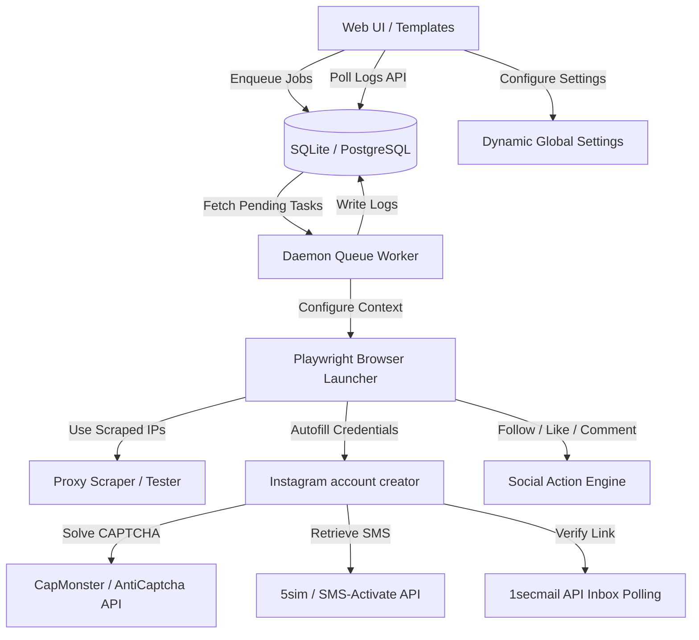

# Instagram SMM Panel

<p align="center">
  
  
  
  
  
</p>

An enterprise-grade, fully automated Instagram SMM (Social Media Marketing) Panel and bot manager. Built on top of **Django** and **Playwright**, the system provides a robust dashboard UI to orchestrate accounts creation, solve CAPTCHAs, manage SMS verifications, maintain rotating proxy pools, and schedule engagement actions (follows, likes, and comments).

Designed with session cookie persistence, a database-backed task queue, dynamic credentials settings, and interactive live console streaming directly in the browser interface.

---

## 📖 Table of Contents
- [✨ Key Features](#-key-features)
- [🏗️ System Architecture](#️-system-architecture)
- [🛠️ Tech Stack](#️-tech-stack)
- [🚀 Quick Start Guide](#-quick-start-guide)
  - [Prerequisites](#prerequisites)
  - [Installation Steps](#installation-steps)
- [⚙️ Configuration Parameters](#️-configuration-parameters)
- [📂 Project Structure](#-project-structure)
- [🔒 Security & Best Practices](#-security--best-practices)
- [🖥️ UI Overview](#️-ui-overview)
- [📦 Production Deployment](#-production-deployment)
- [🤝 Contributing](#-contributing)
- [⚖️ License](#️-license)

---

## ✨ Key Features

* **🖥️ Interactive Dashboard**: Monitor key telemetry (active proxies, account health ratio, completed/running tasks) visually with **Chart.js** diagrams.
* **🍪 Session State Persistence**: Caches browser contexts and session cookies inside `session_cookies/` to avoid repetitive sign-in queries and bypass Instagram verification check blocks.
* **⚡ DB-Backed Queue Worker**: A multithreaded queue processor that handles browser automation in the background. Submit tasks via the UI and track live outputs.
* **📝 Live Stream Console**: Streams automated actions and Playwright process logs directly to a dark console container on the web page.
* **📊 Smart Proxy Rotator**: Scrape fresh proxy pools, verify connection speeds against Instagram endpoints, and rotate active IP configurations automatically.
* **🤖 Anti-Detection Design**: Integrates human typing behavior (variable keystroke delay) and random User-Agent rotation.
* **📂 Bulk CSV Manager**: Import existing account details in bulk or download the complete system registration roster in a click.

---

## 🏗️ System Architecture



---

## 🛠️ Tech Stack

* **Backend Framework**: Django 5.x / 6.x
* **Browser Automation**: Playwright Python
* **HTML Processing**: BeautifulSoup4 & requests
* **Frontend Design**: Vanilla CSS (Responsive Flexbox/Grid layout with custom scrollbars)
* **Visualizations**: Chart.js
* **Database**: SQLite (Default) or PostgreSQL

---

## 🚀 Quick Start Guide

### Prerequisites
- Python 3.10, 3.11, or 3.12
- SQLite3 (installed by default with Python)
- Firefox (`/usr/bin/firefox` pre-installed on Debian/Ubuntu environments)

### Installation Steps

1. **Clone the Repository**
   ```bash
   git clone https://github.com/pain-hub/instagram_smm_panel.git
   cd instagram_smm_panel
   ```

2. **Install Dependencies**
   It is recommended to use a virtual environment. Install packages using pip:
   ```bash
   python3 -m pip install -r requirements.txt
   ```
   *(On Debian/Kali Linux systems enforcing PEP 668, append the `--break-system-packages` flag or run inside a configured venv).*

3. **Initialize the Database**
   Generate database schemas and apply the migration scripts:
   ```bash
   python3 manage.py makemigrations panel
   python3 manage.py migrate
   ```

4. **Launch the Panel Webserver**
   Start the Django development server:
   ```bash
   python3 manage.py runserver 127.0.0.1:8000
   ```
   Access the dashboard at [http://127.0.0.1:8000](http://127.0.0.1:8000).

5. **Launch the Background Worker Daemon**
   To execute the browser automation tasks enqueued by the dashboard, launch the worker process in a separate terminal window:
   ```bash
   python3 manage.py run_worker
   ```

---

## ⚙️ Configuration Parameters

Navigate to the **Settings** view in the sidebar to configure the dynamic parameters:

| Category | Parameter | Description |
| :--- | :--- | :--- |
| **CAPTCHA** | `Solver Provider` | Select CapMonster or AntiCaptcha. |
| | `API Secret Key` | API key from your solving provider dashboard. |
| **SMS** | `SMS Provider` | Select 5sim or SMS-Activate. |
| | `API Auth Token` | Token to acquire and read verification phone numbers. |
| **Automation** | `Browser Engine` | Select **Firefox** (Default) or **Chromium**. |
| | `Local Browser Path` | Absolute path (e.g. `/usr/bin/firefox`). Useful if Playwright downloads time out. |
| | `Delay Range` | Set minimum and maximum delays (seconds) between human actions. |
| | `Headless Mode` | Enable to hide browser window during operations. |

---

## 📂 Project Structure

```bash
instagram_smm_panel/
├── smm_panel_project/               # Core configurations & root routing
│   ├── settings.py                  # Cookies hardening, CSP, frame-ancestors
│   ├── urls.py                      # Django base URLs
│   └── wsgi.py / asgi.py
│
├── panel/                           # SMM Panel app
│   ├── models.py                    # Database tables (Proxy, Account, BotTask, Setting)
│   ├── views.py                     # Controllers (Stats, CSV imports, Logs API)
│   ├── forms.py                     # safe inputs validation forms
│   ├── urls.py                      # App url routes
│   ├── worker.py                    # Background thread pool queue runner
│   │
│   ├── management/commands/
│   │   └── run_worker.py            # CLI daemon command (run_worker)
│   │
│   ├── templates/panel/             # Dashboard HTML Templates
│   │   ├── base.html                # Left Sidebar layouts
│   │   ├── dashboard.html           # Chart widgets
│   │   ├── accounts.html            # Profile grids & bulk uploads
│   │   ├── proxies.html             # Scrapers & speed testers
│   │   ├── targets.html             # Target list (follow/like targets)
│   │   ├── tasks.html               # Job submission dispatchers
│   │   ├── task_detail.html         # Live streaming console log
│   │   └── settings.html            # Credentials management forms
│   │
│   └── bot_logic/                   # Automation modules (Refactored)
│       ├── browser.py               # Playwright browser setups
│       ├── human_behavior.py        # keystroke human behaviors
│       ├── account_creator.py       # signup automation sequence
│       ├── social_actions.py        # Follow, Like, and Comment controls
│       ├── captcha_solver.py        # CapMonster API solvers
│       ├── sms_handler.py           # 5sim endpoint integrations
│       ├── email_verifier.py        # 1secmail inbox polling
│       ├── proxy_scraper.py         # Scraping sslproxies.org
│       └── helper.py                # Unique credentials helpers
│
├── static/css/
│   └── styles.css                   # Custom responsive styling
└── requirements.txt                 # Project dependencies list
```

---

## 🔒 Security & Best Practices

This setup has been developed strictly adhering to secure coding guidelines:
* **Framework Auto-Escaping**: All template variables are escaped by default to mitigate Cross-Site Scripting (XSS).
* **Safe Session Management**: Session and CSRF cookies are set to `HttpOnly` with strict `SameSite=Lax` parameters to prevent token theft and clickjacking.
* **Prepared Queries**: The project avoids string formatting queries, leveraging Django's database ORM parameterization to prevent SQL injection.
* **Resource Cleanup**: Browser context sessions, pages, and playwright instances are closed in nested `try...finally` scopes to ensure memory is freed up correctly.

---

## 📦 Production Deployment

For production deployments:
1. Turn off debug mode in `settings.py` or set the env var `DJANGO_DEBUG=False`.
2. Generate a secure secret key and set it inside `DJANGO_SECRET_KEY` environment variable.
3. Configure `ALLOWED_HOSTS` to match your domain name.
4. Run the Django app using Gunicorn:
   ```bash
   gunicorn smm_panel_project.wsgi:application --bind 127.0.0.1:8000
   ```
5. Set up a systemd daemon service for the background worker (`run_worker`).

---

## 🤝 Contributing

We welcome pull requests! Feel free to:
1. Fork this Repository.
2. Create a feature branch (`git checkout -b feature/NewAwesomeFeature`).
3. Commit your changes (`git commit -m 'Add some NewAwesomeFeature'`).
4. Push to the branch (`git push origin feature/NewAwesomeFeature`).
5. Open a Pull Request.

---

## ⚖️ License

Distributed under the MIT License. See `LICENSE` for more information.